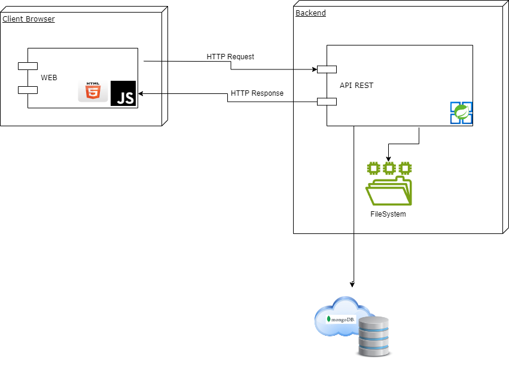

# LABORATORIO 4 - Scrum - DI/IOC

## PRE-RREQUISITOS
- Java OpenJDK Runtime Environment: 17.x.x
- Apache Maven: 3.9.x
- SpringBoot
- Docker
- AzureDevops
- Sonar
- Jacoco

## OBJETIVOS
1. Planeación de un proyecto de software.
2. Entender arquitectura cliente servidor.
3. Inyección de dependencias - Inversión de control.
4. Manejo de bases de datos no relacionales.
6. Definición de API Rest Con SpringBoot.
7. Realizar Análisis estático para garantizar calidad del código y detección de deuda técnica.
8. Integrar pruebas unitarias en el desarrollo del producto.

## CASO DE NEGOCIO - SISTEMA DE RESERVAS DE LABORATORIOS PARA LA DECANATURA DE INGENIERÍA DE SISTEMAS.

El proyecto consiste en una aplicación para la gestión de reservas de laboratorios dentro Ingeniería de Sistemas de la Escuela Colombiana de Ingeniería Julio Garavito. Los usuarios podrán consultar la disponibilidad de laboratorios, realizar reservas y cancelar sus reservas desde una interfaz web. La aplicación se conectará a un API REST desarrollado en Spring Boot. El backend permitirá la inyección de dependencias para el manejo de datos, pudiendo optar entre una base de datos en MongoDB Cloud o un archivo de texto plano para almacenar las reservas.

## REQUERIMIENTOS
- El usuario debe poder consultar la disponibilidad de laboratorios.
- El usuario debe poder reservar un laboratorio especificando fecha, hora y propósito.
- El usuario debe poder cancelar sus reservas.
- La aplicación debe validar que un laboratorio no se pueda reservar si ya está ocupado.

## ÉPICAS
1. Frontend: Crear una interfaz de usuario que permita visualizar la disponibilidad y gestionar reservas.
2. Backend: Implementar un API REST para el manejo de la lógica de negocio y persistencia de datos.

## SPRINTS
Sprint 1: Configuración General del Proyecto
  - Configuración de ambientes (backend y frontend).
  - Scaffolding del proyecto.
  - Configuración de la base de datos (MongoDB Cloud o archivo de texto plano).
  - Definición del modelo de datos (salones y reservas).

Sprint 2: Implementación del API REST
  - Crear los endpoints necesarios para consultar laboratorios, realizar reservas y cancelar reservas.
  - Implementar la lógica de validación para evitar reservas conflictivas.
  - Configurar la persistencia de datos en MongoDB Cloud o archivo de texto plano.

Sprint 3: Conexión del Frontend con el API y Pruebas Finales
  - Desarrollar la interfaz web para visualizar disponibilidad y gestionar reservas.
  - Conectar la interfaz web con el API REST.
  - Realizar pruebas de integración y validación de funcionalidades.

## FEATURES
  1. Consultar Disponibilidad: El usuario puede consultar la disponibilidad de laboratorios para una fecha y hora específicas.
  2. Reservar Laboratorio: El usuario puede reservar un laboratorio seleccionando fecha, hora y propósito.
  3. Cancelar Reserva: El usuario puede cancelar sus reservas existentes.
  4. Validación de Reservas: Evitar reservas duplicadas para un mismo laboratorio, fecha y hora.
  5. Notificación de Reserva Exitosa: Enviar una confirmación al usuario después de realizar la reserva.

## MODELO DE ARQUITECTURA

## PASOS PARA CONSTRUIR EL PROYECTO

1- Cree un proyecto en GitHub para el back y para el front de manera independiente puede utilizar la siguiente guía para definir el scaffolding del back <a href="https://ragunathrajasekaran.medium.com/https-medium-com-ragunathrajasekaran-lets-learn-full-stack-development-part2-7986debc485d" target="_blank">Ver guía</a> No olvide el que el proyecto debe ser maven. Mantenga el esquema de nombramiento de los artefactos.

## PLANEACIÓN DEL PROYECTO.
- Esta sección tiene como objetivo realizar toda la planificación que el equipo de desarrollo requiere para poder dar inicio al proyecto planteado. Para este objetivo utilizaremos Azure DevOps.

- <a href="https://github.com/MicrosoftLearning/AZ400-DesigningandImplementingMicrosoftDevOpsSolutions/blob/master/Instructions/Labs/AZ400_M01_L01_Agile_Plan_and_Portfolio_Management_with_Azure_Boards.md">Tutorial Completo</a>

  1. Cree una cuenta en azureDevOps (Utilice el correo de la escuela) <a href="https://go.microsoft.com/fwlink/?LinkId=2014881" target="_blank">Crear una cuenta</a>
  2. Una vez ingresa deberá crear el proyecto. (Este proceso solo lo realiza un miembro del grupo) Debe seleccionar en configuración avanzada tipo de proceso Scrum.
  3. Cree un equipo en el siguiente tutorial encontrará cómo hacerlo <a href="https://github.com/microsoft/azuredevopslabs/tree/master/labs/azuredevops/agile" target="_blank">Creando equipos</a>, para este proceso todos 
     los integrantes deberán tener una cuenta en AzureDevOps.
  4. Integre los repositorios de gitHub en la configuración de AzureDevOps
       From your project in Azure DevOps, go to Project settings > GitHub connections.
       To add or remove repositories, select the More options ellipses for the connection and choose Add repositories or Remove repositories from the menu.
  5. Defina los spring del proyecto.
  6. Definiendo la épica:
     1- En la sección de Board --> Work Items --> new work item --> Epic --> complete la información de la épica incluyendo la descripción.
  7. Añada los features a la épica previamente debe conectar su repo de GITHUB
  8.  Defina las historias de usuario por cada feature definida.
  9.  Defina las tareas asociadas a cada historia de usuario. Estime tiempos y programe cada actividad con su equipo (squad)
 

## IMPLEMENTACIÓN.
De aceurdo a la planeación realizada divida las tareas de implementación.
A continuación detallamos diferentes tutoriales para el manejo técnico para cada etapa.

  1. Creación de proyecto APIREST <a href="https://blog.codmind.com/mi-primer-api-rest-con-spring-boot/">Documentación 1<a/> <a href="https://programandoenjava.com/crear-un-rest-api-con-spring-boot/">Documentación 2</a>
  2. Consumir APIREST HTML - JAVASCRIPT <a href="https://helpcenter.itmplatform.com/es/project/ejemplo-de-uso-de-api-con-html-javascript/">Ejemplo básico<a/> Utilizar buenas prácticas de programación separación en archivos emplear CSS para mejorar la usabilidad.
  3. Configuración e integración <a href="https://www.mongodb.com/resources/products/compatibilities/spring-boot#getting-started-with-spring-initializr">MongoDB - Atlas</a>
  4. Utilizar integración con Sonar y JACOCO para análisis estático y calidad del código, esto implica el desarrollo de pruebas unitarias.

## GUIA DE ENTREGA Y PRESENTACIÓN
  1. Deben conformar grupos de 4 personas.
  2. El laboratorio se realizará en 2 partes.
  3. Cada estudiante deberá participar en el desarrollo. (Se verá reflejado en los repositorios y en el tablero del proyecto)
  4. Una vez que una caracteristica se encuentra finalizada los merge se validarán mediante pull request.
  5. Deben integrar al equipo al profesor y monitor (Usuarios con cuenta institucional de la escuela)
  6. En el readme deberán generar toda la documentación del proyecto tanto en back como en front.
  7. Fecha de entrega en la semana 7.
